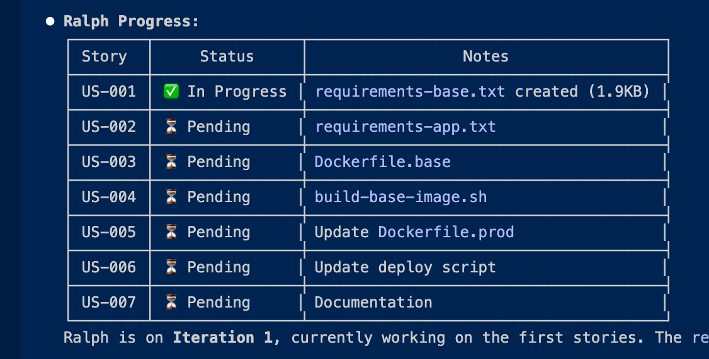
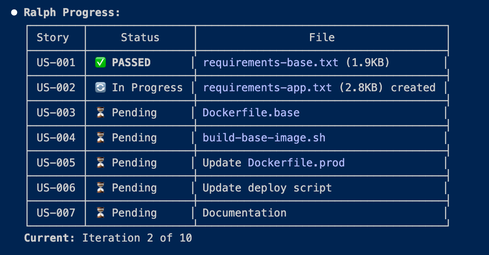

<p align="center">
  
</p>

<p align="center">
  <strong>v2.1.0</strong> ·
  <a href="#skills">12 Skills</a> ·
  <a href="#quick-start">Quick Start</a> ·
  <a href="docs/ralph-comparison.md">vs Ralph Wiggum</a>
</p>

# Ralph for Claude Code CLI

An autonomous AI agent loop that runs Claude Code CLI repeatedly until all PRD items are complete.

This is a fork of [Ralph](https://github.com/snarktank/ralph) adapted for **Claude Code CLI** instead of Amp.

## Quick Start

```bash
# 1. Clone Ralph
git clone https://github.com/thecgaigroup/ralph-cc-loop ~/tools/ralph-cc-loop

# 2. Create a PRD from GitHub issues (in your project)
cd ~/Projects/my-app
claude /review-issues --issue 42

# 3. Run Ralph
~/tools/ralph-cc-loop/ralph.sh ~/Projects/my-app

# 4. Review and merge PRs when done
claude /review-prs --auto-merge
```

## How I Actually Use Ralph

The best way to use Ralph is conversationally through Claude Code CLI. Just open a terminal, run `claude`, and talk to it:

```
You: "I want to work on my-app project at ~/Projects/my-app.
     Can you check GitHub for open issues and help me create a PRD?"

Claude: [Runs /review-issues, scans codebase, generates prd.json]

You: "Looks good. Now run Ralph on it."

Claude: [Runs ./ralph.sh ~/Projects/my-app]

You: "How's it going?"

Claude: [Runs ./ralph.sh status ~/Projects/my-app]

You: "Great. Now check the PRs and merge the safe ones."

Claude: [Runs /review-prs --auto-merge]
```

**This conversational approach lets you:**

- **Explain what you're trying to do** in plain English - Claude figures out the commands
- **Monitor progress** by asking "how's Ralph doing?" or "what's the status?"
- **Open multiple sessions** - run Ralph in one terminal, chat in another
- **Mix and match tasks** - create PRDs for different features, review PRs, check issues
- **Get help** - ask Claude to explain what Ralph is doing or troubleshoot issues

**Example multi-session workflow:**

```
# Terminal 1: Run Ralph
~/tools/ralph-cc-loop/ralph.sh ~/Projects/my-app 20

# Terminal 2: Chat with Claude while Ralph runs
claude
> "Check the status of Ralph on my-app"
> "Are there any other open issues I should look at?"
> "Create a separate PRD for issue #15"
> "How many PRs are waiting for review?"
```

Everything happens right from the Claude Code CLI chat window - you don't need to memorize commands.

### Example Session

Here's what it looks like in practice - chatting with Claude while Ralph runs in the background:



Ask Claude to check progress again and get an updated status table:



Claude shows you a formatted table with story status, current iteration, and context about what Ralph is working on.

## Prerequisites

- [Claude Code CLI](https://docs.anthropic.com/en/docs/claude-code) installed and authenticated
- `jq` installed (`brew install jq` on macOS)
- `gh` (GitHub CLI) installed and authenticated
- A git repository for your project
- Claude Code Max subscription ($200/month) recommended for heavy usage

### GitHub CLI Setup

Ralph uses `gh` for creating PRs and fetching issues:

```bash
# Install GitHub CLI
brew install gh

# Authenticate (one-time)
gh auth login
```

The repository is auto-detected from git remote, or you can specify `githubRepo` in prd.json.

## Architecture: Run From Here, Point At Projects

Ralph runs from its install directory and operates on target projects on the same machine.

```
LOCAL MACHINE
├── ~/tools/ralph-cc-loop/    ← Ralph install (run from here)
│   ├── ralph.sh
│   ├── prompt.md
│   └── skills/
│
├── ~/Projects/my-app/        ← Target project A
│   ├── prd.json              ← Ralph reads this
│   ├── progress.txt          ← Ralph writes here
│   └── src/...
│
└── ~/Projects/other-app/     ← Target project B
    ├── prd.json
    └── ...
```

### Multiple Projects

Run separate terminal sessions for each project:

```bash
# Terminal 1
./ralph.sh ~/Projects/my-app

# Terminal 2
./ralph.sh ~/Projects/other-app
```

Projects don't share state. Each has its own `prd.json`, `progress.txt`, and logs.

## Setup

```bash
# Clone Ralph to a permanent location
git clone https://github.com/thecgaigroup/ralph-cc-loop ~/tools/ralph-cc-loop

# Optional: add alias to your shell config
alias ralph="~/tools/ralph-cc-loop/ralph.sh"
```

### Install Plugin (for /prd, /qa-audit, etc.)

To use the skills as slash commands, install the plugin:

```bash
# Validate the plugin
claude plugin validate ~/tools/ralph-cc-loop

# Install globally (copy to Claude plugins cache)
mkdir -p ~/.claude/plugins/cache/local/ralph-claude-code/2.1.0
cp -R ~/tools/ralph-cc-loop/.claude-plugin/* ~/.claude/plugins/cache/local/ralph-claude-code/2.1.0/

# Add to installed plugins
# (Or restart Claude Code and use --plugin-dir flag once)
claude --plugin-dir ~/tools/ralph-cc-loop
```

After installation, restart Claude Code to use all 12 skills:
- Core: `/prd`, `/review-issues`, `/review-prs`
- Quality: `/qa-audit`, `/test-coverage`, `/a11y-audit`, `/perf-audit`
- Maintenance: `/deps-update`, `/refactor`, `/migrate`
- Docs: `/docs-gen`, `/onboard`

Then run against any project:
```bash
~/tools/ralph-cc-loop/ralph.sh ~/Projects/my-app
# or with alias:
ralph ~/Projects/my-app
```

## Workflow

### 1. Create a PRD

Create a `prd.json` file in your project root. See `prd.json.example` for the format:

```json
{
  "project": "My Project",
  "branchName": "ralph/feature-name",
  "description": "Description of what we're building",
  "userStories": [
    {
      "id": "US-001",
      "title": "First task",
      "description": "What to implement",
      "acceptanceCriteria": [
        "Criteria 1",
        "Criteria 2",
        "Tests pass"
      ],
      "priority": 1,
      "passes": false,
      "notes": ""
    },
    {
      "id": "US-002",
      "title": "Second task (depends on first)",
      "description": "What to implement",
      "dependsOn": ["US-001"],
      "acceptanceCriteria": ["..."],
      "priority": 2,
      "passes": false,
      "notes": ""
    }
  ]
}
```

### Story Dependencies

Use the optional `dependsOn` field to ensure stories execute in the correct order:

```json
{
  "id": "US-003",
  "dependsOn": ["US-001", "US-002"],
  ...
}
```

- Stories with unmet dependencies are skipped until their dependencies pass
- Dependencies are specified as an array of story IDs
- Use dependencies when a story requires code/schema from another story

### Modes: Feature vs Backlog

Ralph supports two modes via the `mode` field:

**Feature Mode** (default) - Single branch, one PR at end:
```json
{
  "mode": "feature",
  "branchName": "ralph/my-feature"
}
```

**Backlog Mode** - Branch per story/issue, PR after each:
```json
{
  "mode": "backlog",
  "baseBranch": "main"
}
```

Use backlog mode for independent bug fixes or tech debt tasks.

### GitHub Integration

Link stories to GitHub issues for automatic PR creation with `Closes #X`:

```json
{
  "githubRepo": "owner/repo",
  "githubIssues": [13, 14],
  "userStories": [
    {
      "id": "GH-13-1",
      "githubIssue": 13,
      "title": "Fix audio playback",
      ...
    }
  ]
}
```

Generate PRDs from GitHub issues using the `/review-issues` skill:
```bash
claude /review-issues --repo owner/repo --issue 13,14,15
claude /review-issues --label bug --mode backlog
```

Or create PRDs interactively with `/prd`:
```bash
claude /prd "Add user authentication to the app"
```

### 2. Run Ralph

```bash
# From Ralph's directory, targeting a project
./ralph.sh ~/Projects/my-app          # 10 iterations (default)
./ralph.sh ~/Projects/my-app 20       # 20 iterations

# Or from within your project (if ralph.sh is copied there)
./ralph.sh                            # Current directory, 10 iterations
./ralph.sh 20                         # Current directory, 20 iterations
```

Ralph will:
1. Create a feature branch (from PRD `branchName`)
2. Pick the next eligible story (highest priority where `passes: false` and all `dependsOn` stories have passed)
3. Implement that single story
4. Run quality checks (typecheck, tests)
5. Commit if checks pass
6. Update `prd.json` to mark story as `passes: true`
7. Append learnings to `progress.txt`
8. Repeat until all stories pass or max iterations reached

## Monitoring Progress

Ralph provides multiple ways to monitor long-running iterations:

### Real-time Output Log

Ralph streams all Claude output to `ralph-output.log` in your project directory. Monitor it in a separate terminal:

```bash
# Follow the full output stream in real-time
tail -f ~/Projects/my-app/ralph-output.log

# Or with colored output
tail -f ~/Projects/my-app/ralph-output.log | less -R +F
```

### Progress Summary

The `progress.txt` file contains high-level learnings and status from each iteration:

```bash
# Watch progress summary
tail -f ~/Projects/my-app/progress.txt

# Or use watch for periodic updates
watch -n 5 cat ~/Projects/my-app/progress.txt
```

### Terminal Controls

While Ralph is running in the foreground:

| Key | Action |
|-----|--------|
| `Ctrl+B` | Background the task and continue using Claude Code |
| `Ctrl+C` | Interrupt the current iteration |
| `Ctrl+O` | Toggle verbose output mode |
| Enter/Scroll | Expand collapsed output lines |

### Check PRD Status

Use the built-in status command for a quick overview:

```bash
./ralph.sh status                    # Status for current directory
./ralph.sh status ~/Projects/my-app  # Status for specific project
```

Example output:
```
╔═══════════════════════════════════════════════════════╗
║                    Ralph Status                       ║
╚═══════════════════════════════════════════════════════╝

  Project:  MyApp
  Branch:   ralph/task-priority
  Location: /Users/you/Projects/my-app

  Stories:  1/4 complete
            2 ready to implement
            1 blocked by dependencies

  Last run: Sat Jan 10 14:32:01 PST 2026

  Stories:
  ────────────────────────────────────────────────────
  ✓ US-001: Add priority field to database
  ○ US-002: Display priority indicator on task cards
  ○ US-003: Add priority selector to task edit
  ⊘ US-004: Filter tasks by priority

  Legend: ✓ complete  ○ ready  ⊘ blocked
```

Or use jq for raw data:

```bash
cat ~/Projects/my-app/prd.json | jq '.userStories[] | {id, title, passes}'
```

## Key Files

| File | Location | Purpose |
|------|----------|---------|
| `ralph.sh` | Ralph install | The bash loop that spawns Claude Code instances |
| `prompt.md` | Ralph install | Instructions given to each Claude Code instance |
| `.claude-plugin/` | Ralph install | Plugin manifest and skills (12 skills - see below) |
| `prd.json` | Target project | User stories with `passes` status |
| `progress.txt` | Target project | Append-only learnings (created by Ralph) |
| `ralph-output.log` | Target project | Full Claude output (created by Ralph) |
| `archive/` | Target project | Previous run archives (created by Ralph) |

## Skills

Ralph includes 12 skills for common workflows. Run any skill with `claude /skill-name`.

### Core Workflow Skills

| Skill | Purpose |
|-------|---------|
| `/prd` | Create PRD interactively by describing a feature |
| `/review-issues` | Generate PRD from GitHub issues |
| `/review-prs` | Review, approve, and merge pull requests |

```bash
claude /prd "Add task priority system"
claude /review-issues --issue 42 --mode backlog
claude /review-prs --auto-merge
```

### Quality & Audit Skills

| Skill | Purpose |
|-------|---------|
| `/qa-audit` | Production readiness audit with full remediation |
| `/test-coverage` | Find untested code and generate tests |
| `/a11y-audit` | WCAG accessibility audit and remediation |
| `/perf-audit` | Performance profiling and optimization |

```bash
claude /qa-audit ~/Projects/my-app --env staging
claude /test-coverage ~/Projects/my-app
claude /a11y-audit ~/Projects/my-app --level AA
claude /perf-audit ~/Projects/my-app --focus frontend
```

### Maintenance Skills

| Skill | Purpose |
|-------|---------|
| `/deps-update` | Update dependencies, fix vulnerabilities, create PRs |
| `/refactor` | Detect code smells, reduce complexity, apply patterns |
| `/migrate` | Framework/version migration (React, Node, ESM, etc.) |

```bash
claude /deps-update ~/Projects/my-app
claude /refactor ~/Projects/my-app --scope src/utils/
claude /migrate ~/Projects/my-app react-18-to-19
```

### Documentation Skills

| Skill | Purpose |
|-------|---------|
| `/docs-gen` | Generate/update README, API docs, architecture docs |
| `/onboard` | Create new developer onboarding documentation |

```bash
claude /docs-gen ~/Projects/my-app
claude /onboard ~/Projects/my-app
```

---

### Skill Details

#### `/prd` - Create PRD Interactively

Create a PRD by describing your feature - Claude will break it down into right-sized stories:

```bash
claude /prd "Add task priority system with high/medium/low levels"
```

#### `/review-issues` - Generate PRD from GitHub Issues

Pull GitHub issues and scan the codebase to generate a PRD with proper file references:

```bash
claude /review-issues --issue 42           # Single issue
claude /review-issues --issue 13,14,15     # Multiple issues
claude /review-issues --label bug          # By label
claude /review-issues --milestone v2.0     # By milestone
```

#### `/review-prs` - Review and Merge Pull Requests

Review, approve, and merge PRs with intelligent handling of Dependabot updates:

```bash
claude /review-prs --auto-merge            # All PRs, auto-merge safe ones
claude /review-prs --dependabot-only       # Just Dependabot PRs
claude /review-prs --pr 14                 # Specific PR
```

**Dependabot auto-merge rules:**
- Patch updates (`1.0.0 → 1.0.1`): Auto-merge if CI passes
- Minor updates (`1.0.0 → 1.1.0`): Auto-merge if CI passes
- Major updates (`1.0.0 → 2.0.0`): Flagged for human review

#### `/qa-audit` - Production Readiness Audit

Run a comprehensive QA audit with full remediation:

```bash
claude /qa-audit ~/Projects/my-app --env local
```

**What it audits & remediates:**
- **Security**: Secrets, dependencies, auth, input validation
- **Testing**: Unit tests, E2E, critical paths, API tests
- **Performance**: Load times, bottlenecks
- **Documentation**: README, API docs, deployment
- **CI/CD**: Pipeline validation

#### `/deps-update` - Dependency Updates

Audit and update outdated dependencies:

```bash
claude /deps-update ~/Projects/my-app
```

**What it does:**
- Security vulnerability fixes (priority 1)
- Major version updates (with breaking change analysis)
- Minor/patch batched updates
- Dev dependency updates
- Unused dependency cleanup

#### `/test-coverage` - Test Coverage Analysis

Find untested code and generate tests:

```bash
claude /test-coverage ~/Projects/my-app
```

**What it does:**
- Run coverage analysis
- Identify critical paths without tests
- Generate tests for zero-coverage files
- Improve low-coverage files to >80%
- Add integration and API tests

#### `/a11y-audit` - Accessibility Audit

WCAG compliance audit and remediation:

```bash
claude /a11y-audit ~/Projects/my-app --level AA
```

**What it audits:**
- Semantic HTML structure
- Images and alt text
- Form accessibility
- Keyboard navigation
- Color contrast
- ARIA attributes

#### `/perf-audit` - Performance Audit

Profile and optimize application performance:

```bash
claude /perf-audit ~/Projects/my-app --focus all
```

**What it optimizes:**
- Bundle size and code splitting
- Image optimization
- Core Web Vitals (LCP, FID, CLS)
- API response times
- Database queries
- Caching strategy

#### `/refactor` - Code Refactoring

Detect code smells and reduce technical debt:

```bash
claude /refactor ~/Projects/my-app
```

**What it fixes:**
- High complexity functions
- Duplicate code
- God classes/files
- Deep nesting
- Dead code
- Type safety issues

#### `/migrate` - Framework Migration

Assist with version and framework migrations:

```bash
claude /migrate ~/Projects/my-app react-18-to-19
claude /migrate ~/Projects/my-app cjs-to-esm
claude /migrate ~/Projects/my-app node-18-to-20
```

**Supported migrations:**
- React version upgrades
- CommonJS to ES Modules
- Node.js version upgrades
- TypeScript version upgrades
- ORM migrations (Sequelize → Prisma)

#### `/docs-gen` - Documentation Generator

Generate and update project documentation:

```bash
claude /docs-gen ~/Projects/my-app
```

**What it creates:**
- README with badges, installation, usage
- API documentation (OpenAPI/Swagger)
- Architecture documentation with diagrams
- Development setup guide
- Deployment documentation
- CHANGELOG

#### `/onboard` - Onboarding Documentation

Generate new developer onboarding docs:

```bash
claude /onboard ~/Projects/my-app
```

**What it creates:**
- Quick start guide (5-minute setup)
- Architecture overview with diagrams
- Directory structure guide
- Development workflow
- Code patterns guide
- Troubleshooting guide

## File Attribution

All Ralph-generated files include clear attribution for tracking:

**In target project:**
- `progress.txt` - Header includes project name and Ralph attribution
- `ralph-output.log` - Header includes project name and Ralph attribution
- Commits end with `🤖 Generated by Ralph`
- PRs include `🤖 Generated by Ralph` in the body

**Archive organization:**
```
archive/
└── my-project/
    └── 2024-01-10-feature-name/
        ├── prd.json
        ├── progress.txt
        └── ralph-output.log
```

## Differences from Amp Version

| Feature | Amp Version | Claude Code Version |
|---------|-------------|---------------------|
| CLI command | `amp --dangerously-allow-all` | `claude --print --dangerously-skip-permissions` |
| Thread references | Uses `$AMP_CURRENT_THREAD_ID` | Not available |
| Browser tool | `dev-browser` skill | `mcp__puppeteer` or Browser tool |
| Config files | `AGENTS.md` | `CLAUDE.md` or `AGENTS.md` |

## Ralph vs Ralph Wiggum

There are two "Ralph" systems for iterative Claude Code execution:

| | ralph-cc-loop (this repo) | ralph-wiggum (plugin) |
|---|:---:|:---:|
| **Type** | Bash script | Claude Code plugin |
| **State tracking** | `prd.json` stories | Stateless |
| **Progress** | `passes: true/false` per story | Reads files each iteration |
| **Git integration** | Branches, commits, PRs | Manual |
| **Story dependencies** | ✅ Built-in | ❌ |
| **Status command** | ✅ `./ralph.sh status` | ❌ |
| **Best for** | Discrete, trackable tasks | Open-ended exploration |

### When to Use Each

**Use ralph-cc-loop when:**
- You can define discrete tasks upfront
- You want automatic git integration (branches, commits, PRs)
- You need progress tracking and visibility
- Tasks have dependencies on each other

**Use ralph-wiggum when:**
- You want Claude to self-direct the work
- Tasks are exploratory or open-ended
- You have a goal but unclear steps
- You want "keep going until you figure it out"

See [docs/ralph-comparison.md](docs/ralph-comparison.md) for a detailed feature comparison.

## Critical Concepts

### Each Iteration = Fresh Context

Each iteration spawns a **new Claude Code instance** with clean context. The only memory between iterations is:

- Git history (commits from previous iterations)
- `progress.txt` (learnings and context)
- `prd.json` (which stories are done)

### Small Tasks

Each PRD item should be small enough to complete in one context window. If a task is too big, Claude runs out of context before finishing.

**Right-sized stories:**
- Add a database column and migration
- Add a UI component to an existing page
- Update a server action with new logic

**Too big (split these):**
- "Build the entire dashboard"
- "Add authentication"
- "Refactor the API"

### CLAUDE.md Updates Are Critical

After each iteration, Ralph updates the relevant `CLAUDE.md` files with learnings. This is key because Claude Code automatically reads these files, so future iterations benefit from discovered patterns, gotchas, and conventions.

## Debugging

See [Monitoring Progress](#monitoring-progress) for real-time monitoring options.

```bash
# Check git history
git log --oneline -10

# See full Claude output from all iterations
less ralph-output.log

# Search for errors in output
grep -i "error\|failed\|exception" ralph-output.log
```

## Customizing prompt.md

Edit `prompt.md` to customize Ralph's behavior for your project:

- Add project-specific quality check commands
- Include codebase conventions
- Add common gotchas for your stack

## Plugin Integration

Ralph can leverage official Claude Code plugins for enhanced capabilities. Add a `plugins` section to your `prd.json`:

```json
{
  "plugins": {
    "recommended": ["security-guidance", "commit-commands"],
    "optional": ["code-simplifier", "frontend-design", "pr-review-toolkit"]
  }
}
```

### Recommended Plugins

| Plugin | Purpose | Install |
|--------|---------|---------|
| `security-guidance` | Passive security warnings | Auto-installed |
| `commit-commands` | Better commit messages | Auto-installed |
| `code-simplifier` | Reduce code complexity | `claude plugins install code-simplifier` |
| `frontend-design` | Production-grade UI code | `claude plugins install frontend-design` |
| `pr-review-toolkit` | Multi-aspect code review | `claude plugins install pr-review-toolkit` |
| `typescript-lsp` | TypeScript intelligence | `claude plugins install typescript-lsp` |
| `pyright-lsp` | Python type checking | `claude plugins install pyright-lsp` |

### How Plugins Are Used

- **security-guidance**: Passively monitors edits for vulnerabilities
- **commit-commands**: `/commit` generates style-matching commit messages
- **code-simplifier**: `/code-simplifier:simplify` refactors complex files
- **pr-review-toolkit**: `/pr-review-toolkit:code-reviewer` validates before completion
- **frontend-design**: Automatically enhances UI/frontend code quality

If a plugin is listed but not installed, Ralph skips it gracefully.

## License

MIT

